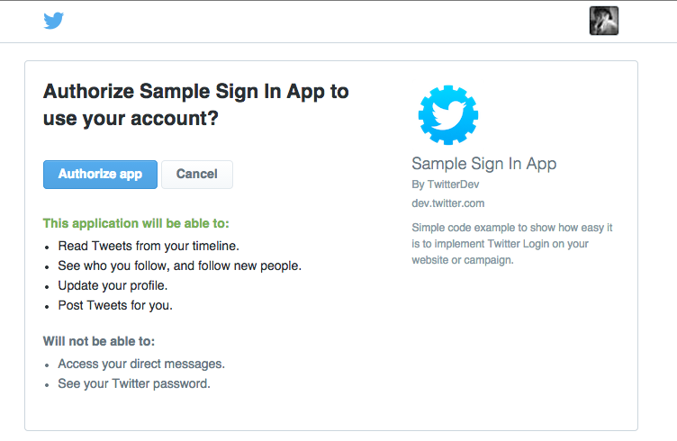
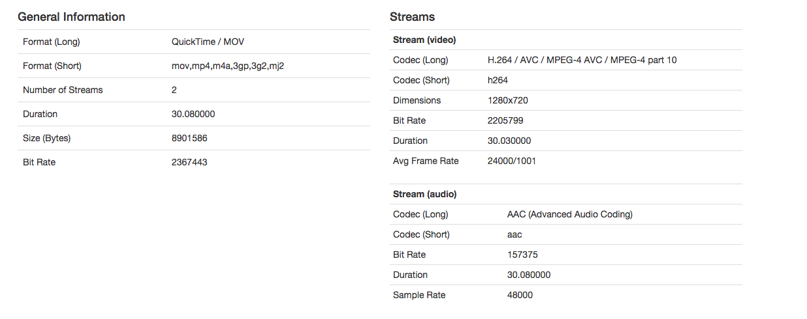

Twitter REST API Samples
=================

Sample Django App using Twitter Sign in (OAuth) and REST APIs. This is the basis for many
types of campaigns, including:

- Capture @username via Twitter Login
- Contest/sweepstakes sign-up via Twitter
- Tweet out a photo from a user (requires user's explicit consent)
- Induce interests via friends & followers 

As always, when developing on top of the Twitter platform, you must abide by the [Developer Agreement & Policy](https://dev.twitter.com/overview/terms/agreement-and-policy). 

Requirements
============

To run this sample code, you'll need to install the following libraries:

- Python Social Auth (https://github.com/omab/python-social-auth)
- Python Twitter (https://github.com/bear/python-twitter)
- south (http://south.aeracode.org/)
- Fabric (http://www.fabfile.org/)

You can install these with the following command:

    pip install -r requirements.txt

Be sure you are using pip 9.0.1 or higher to avoid issues installing 'cryptography'.

You also need to have Postgres installed on your machine. Additionally, you should have pg_config in the path. One shortcut
depending on your installation may be:

export PATH=$PATH:/Applications/Postgres.app/Contents/Versions/latest/bin

Getting Started
============

- Create a Twitter App (https://apps.twitter.com/)

- In the Twitter App config, ensure the Callback URL is `http://127.0.0.1:9000/complete/twitter`

- In the settings.py or settings_my.py, set the following to your own key:

    SECRET_KEY = 'YOUR_SECRET_KEY'

- Specify your Twitter API credentials in app/settings_my.py under the following section:

    SOCIAL_AUTH_TWITTER_KEY = ''
    
    SOCIAL_AUTH_TWITTER_SECRET = ''
    
    TWITTER_ACCESS_TOKEN = ''
    
    TWITTER_ACCESS_TOKEN_SECRET = ''
    	
- To initialize your database, run the from the `django-rest-apis` directory:

  `python manage.py makemigrations --settings=app.settings_my`
  
  Then run:
  
  `python manage.py migrate --settings=app.settings_my`
  
- Create an admin user for the Django admin by running the following:
  
  `python manage.py createsuperuser --settings=app.settings_my`
  
- To start the server, run the following from the `django-rest-apis` directory:

  `fab start`
  
- Open a browser and go to http://127.0.0.1:9000

Restricting Django Admin Access
--------

This code sample allows for restriction of Django admin based on IP. To enable this, do the following:

- Run the migration for this as follows:

  `python manage.py makemigrations adminrestrict --settings=app.settings_my` 
  
  Then:
  
  `python manage.py migrate adminrestrict --settings=app.settings_my

- Log in as the Admin user and create a * record in the adminrestrict.allowed_ip table. 

- Lastly, uncomment the following from the MIDDLEWARE_CLASSES section in settings.py:

   `adminrestrict.middleware.AdminPagesRestrictMiddleware`

Invalidate Twitter tokens 
--------

For security, this code sample has a batch process to clear out Twitter auth tokens for users that either:

- Have a login of greater than 30 days ago, or 
- Have never logged in and joined greater than 30 days ago

To run the process, simply execute:

	`fab invalidate'

Deploying to Heroku
============

Deploying to Heroku is even easier. The defaults in settings.py are pre-configured  to easily deploy to Heroku.

- Create a Twitter App (https://apps.twitter.com/)
- Click on the Heroku button below
- When prompted during the Heroku install, specify your:

	- CONSUMER_KEY
	- CONSUMER_SECRET
	- ACCESS_TOKEN
	- ACCESS_TOKEN_SECRET
	
- After deploying, in the Twitter App config, ensure the Callback URL is `http://your-app-name.herokuapp.com/complete/twitter`

- To sync the database, use the Heroku CLI and run the following:

	`heroku run python manage.py migrate --app your-app-name`
	
- Open a browser and go to the URL specified by your deploy (http://your-app-name.herokuapp.com)

- To create an admin user, use the following Heroku CLI command:

	`heroku run python manage.py createsuperuser --username=USERNAME --email=EMAIL --app your-app-name`
	
Then log in via the Admin console and update your initial Twitter login user accordingly. 

- Open a browser and go to the URL specified by your deploy (http://your-app-name.herokuapp.com)

Invalidating Twitter tokens on Heroku
--------

To ensure the token invalidation script works properly on Heroku, run the following from your machine: 

	`heroku run fab invalidate --app=MY_APP_NAME'
	
If this runs properly, follow the below steps to run it as a scheduled job on Heroku:

- Run `heroku addons:add scheduler:standard --app=MY_APP_NAME`
- Log into heroku.com, open your app and go to "Resources"
- Click on "Heroku Scheduler" and then "Add a New Job"
- Type in `fab invalidate`

Confirm successful execution by viewing the output in the Heroku app logs.

Working with Video
=========

This sample code also allows you to upload and inspect video. It requires that ffprobe (as part of ffmpeg) 
be installed on the machine. When installed, video uploads will show additional debugging information:

By default, the media debug is included on the publicly maintained version of this site: http://django-rest-apis.herokuapp.com.
When posting video issues to the Twitter Community forums, please include the output of the Media Inspector
to help us debug/investigate issues.

Enabling ffmpeg
---------

To enable the ffmpeg on your local machine, visit the [ffprobe/ffmpeg documentation](https://ffmpeg.org/ffprobe.html).

Enabling ffmpeg on Heroku
----------

Additionally, you can get the ffprobe portion of the code sample working on Heroku as well. You need to do the following:

- Set the root buildpack with the following setting:

	heroku buildpacks:set https://github.com/integricho/heroku-buildpack-python-ffmpeg --app your-app-name
	
Which will tell you to rebuild, as such:

	Buildpack set. Next release on hellobootcamp will use https://github.com/integricho/heroku-buildpack-python-ffmpeg.
	Run git push heroku master to create a new release using this buildpack.
	
- Rebuild & deploy the app (either via command line or via the UI)

Lastly, sample video provided by [TechSlides.com](http://techslides.com/sample-webm-ogg-and-mp4-video-files-for-html5).

Notes
============

**** Python libraries: six ****

During installation of packages, you may get errors regarding the "six" Python library, as such:

    OSError: [Errno 1] Operation not permitted: '/tmp/pip-sUDfPK-uninstall/System/Library/Frameworks/Python.framework/Versions/2.7/Extras/lib/python/six-1.4.1-py2.7.egg-info'

This is because Macs come with their own Python install and six library. To work around this, you need to do the following:

    sudo -H pip install --ignore-installed six

Read more here:

    https://github.com/pypa/pip/issues/3165

**** Python libraries: six ****

During Python library installation, you may also get this error:

    Command "/usr/bin/python -c "import setuptools, tokenize;__file__='/private/tmp/pip-build-uUY19r/cryptography/setup.py';exec(compile(getattr(tokenize, 'open', open)(__file__).read().replace('\r\n', '\n'), __file__, 'exec'))" install --record /tmp/pip-sWMOT3-record/install-record.txt --single-version-externally-managed --compile" failed with error code 1 in /private/tmp/pip-build-uUY19r/cryptography

Be sure you have a version of PIP 9.0.1 or higher.

**** NTP/Time issues ****

If you receive a 401 at login/twitter it is most likely caused by a datetime discrepancy between the server making the
request and the Twitter server. Use NTP to sync time on your server to compensate for the drift.

If you are getting this
error on OSX, toggle the "set time zone" checkbox off and back on in Date & Time system preferences for a manual and
temporary fix. It has been reported that OSX 10.9 Mavericks has an issue with time drift.
